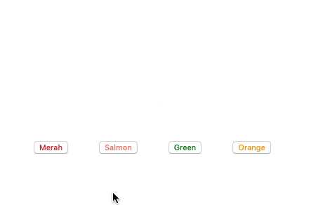

## 26 Oktober 2022
## Javascript - Scope

- ### Pengertian
    Scope adalah konsep dalam flow data variabel. Menentukan suatu variabel bisa diakses pada scope tertentu atau tidak. Analogi mudahnya kita semua bisa melihat bintang-bintang dilangit karena bersifat global, tetapi jika kita tinggal di Aceh kita tidak bisa melihat monas yang ada di jakarta.

- ### Blocks
    Blocks adalah code yang berada didalam curly braces {}. Conditional, function, dan  looping menggunakan blocks.

- ### Global Scope
    Global scope berarti variabel yang kita buat dapat diakses dimanapun dalam suatu file. Agar menjadi Global Scope, suatu variabel harus dideklarasikan diluar Blocks.
    ```javascript
    let myName = 'Justin';

    function greeting(){
        return myName; // Justin
    }

    consonle.log(myName); // Justin
    ```

- ### Local Scope
    Local scope berarti kita mendeklarasikan variabel didalam blocks seperti function, conditional, dan looping. Maka variabel hanya bisa diakses didalam blocks saja. Tidak bisa diakses diluar blocks.
    ```javascript
    function greeting(){
        let myName = 'Justin';
        return myName; // Justin
    }

    consonle.log(greeting()); // Justin
    consonle.log(myName); // Uncaught ReferenceError: myName is not defined because local scope
    ```

## Javascript - Function

- ### Permasalahan
    Terkadang, saat kita membuat fitur program, kita memiliki beberapa perintah yang sama, yang selalu kita tulis berulang - ulang, sehingga baris kode yang kita miliki menjadi banyak sehingga kode yang kita buat tidak cukup efektif.

    Lalu bagaimana cara agar kita membuat program kita lebih efektif, tidak menulis perintah yang sama secara berulang - ulang ?

- ### Penjelasan
    Fungsi merupakan kumpulan perintah yang digabung menjadi satu dan bisa dipanggil secara bersamaan. Apabila ada perintah - perintah yang sama, bisa kita masukkan ke dalam fungsi, sehingga kita tidak perlu menuliskan perintah yang sama tersebut berulang kali.

    + Cara membuat fungsi
        Untuk membuat sebuah fungsi, kita dapat menggunakan kata kunci `function` dengan diikuti nama fungsinya. Berikut contoh pembuatan fungsi untuk menghitung luas persegi panjang.

        ```javascript
        // membuat fungsi untuk menghitung luas persegi panjang
        function hitungLuasPersegiPanjang() {
        var panjang = 5
        var lebar = 6
        var luas = panjang * lebar
        console.log(luas)
        }

        // menjalankan fungsi
        hitungLuasPersegiPanjang() // output : 30

        // fungsi bisa dijalankan lagi
        hitungLuasPersegiPanjang() // output : 30
        ```

        Apabila kita menjalankan fungsi `hitungLuasPersegiPanjang` diatas, maka pada console browser akan muncul output `30` dari hasil perhitungan luas persegi panjang. Apabila kita ingin menghitung luas persegi panjang lagi, kita tinggal memanggil fungsi `hitungLuasPersegiPanjang` tersebut sekali lagi, jadi tidak perlu menuliskan script hitung luas persegi berkali - kali
    
    + Jenis-jenis Fungsi
        1. Menggunakan cara biasa;
            Berikut cara membuat fungsi yang paling sederhana yang sudah dicontohkan pada penjelasan diatas.
            ```javascript
            function hitungLuasPersegiPanjang() {
            var panjang = 5
            var lebar = 6
            var luas = panjang * lebar
            console.log(luas)
            }
            ```
        2. Menggunakan parameter
            Pada contoh fungsi sebelumnya, kita bisa menghitung luas persegi panjang secara berulang kali, namun `panjang` dan `lebar` dari persegi panjang yang dihitung selalu sama. Agar kita dapat mengubah nilai dari `panjang` dan `lebar` pada fungsi `hitungLuasPersegiPanjang`, maka kita dapat menggunakan parameter. Kemudian, kita dapat memasukkan `panjang` dan `lebar` dari persegi panjang setiap kali kita memanggil fungsi `hitungLuasPersegiPanjang`

            ```javascript
            // membuat fungsi dengan parameter panjang dan lebar
            function hitungLuasPersegiPanjang(panjang, lebar) {
            var luas = panjang * lebar
            console.log(luas)
            }

            // menjalankan fungsi dengan memasukkan nilai parameter
            hitungLuasPersegiPanjang(5, 6) // output : 30
            hitungLuasPersegiPanjang(2, 4) // output : 8
            hitungLuasPersegiPanjang(3, 5) // output : 15
            ```
        3. Menggunakan return
            Agar nilai dari perhitungan luas persegi panjang dapat diolah kembali, kita dapat mengembalikan nilai dari fungsi `hitungLuasPersegiPanjang` menggunakan perintah `return`

            ```javascript
            // index.js

            // membuat fungsi yang mengembalikan nilai dari luas
            function hitungLuasPersegiPanjang(panjang, lebar) {
            var luas = panjang * lebar
            return luas
            }

            var hasil = hitungLuasPersegiPanjang(5, 6) + 20
            console.log(hasil) // output : 50
            ```

- ### Contoh Kasus
    + Membuat file index.html
        Pertama-tama, buatlah file `index.html` dan isi file html tersebut dengan kode di bawah ini.

        ```html
        <!-- index html -->

        <!DOCTYPE html>
        <html lang="en">
        <head>
            <meta charset="UTF-8" />
            <title>Function</title>
            <link rel="stylesheet" href="style.css" />
            <!-- menghubungkan ke file style.css -->
        </head>
        <body>
            <div id="kotak"></div>
            <button class="merah" onclick="berubah('red')">Merah</button>
            <button class="salmon" onclick="berubah('salmon')">Salmon</button>
            <button class="hijau" onclick="berubah('greenyellow')">Green</button>
            <button class="orange" onclick="berubah('orange')">Orange</button>
        </body>
        <script src="script.js"></script>
        <!-- menghubungkan dengan file script.js -->
        </html>
        ```
    
    + Membuat file style.css
        Buatlah file `style.css` yang nantinya akan digunakan untuk menerapkan text formatting pada index.html. Kemudian, terapkan kode di bawah ini untuk mengubah style pada div yang memiliki id `kotak`. ubah juga style button nya.

        ```css
        /* style.css */

        #kotak {
        width: 100px;
        height: 100px;
        position: relative;
        background: transparent;
        margin: 50px 50px 50px 150px;
        }

        button {
        margin-left: 40px;
        transition-duration: 0.4s;
        }

        .merah {
        color: red;
        }
        .salmon {
        color: salmon;
        }
        .hijau {
        color: green;
        }
        .orange {
        color: orange;
        }
        ```
    
    + Membuat file javascript
        Buatlah file `script.js` yang nantinya akan digunakan untuk menerapkan fungsi yang akan mengubah warna dari setiap kotak ketika button di klik.

        ```javascript
        // script.js

        function berubah(warna) {
        document.getElementById('kotak').style.background = warna
        }
        ```
        hingga hasilnya menjadi:
        