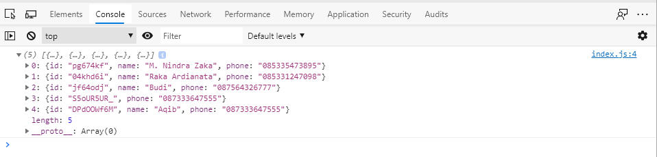
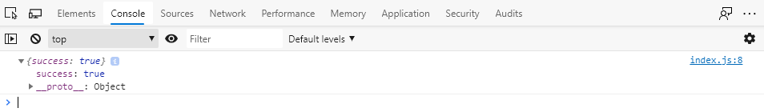
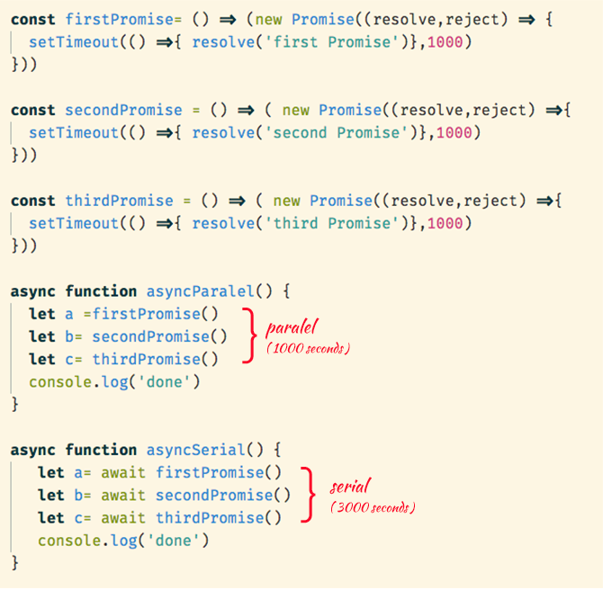
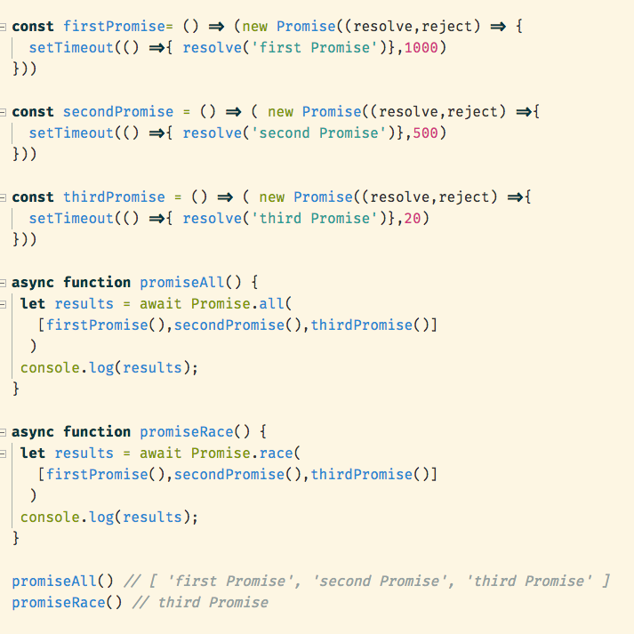

## 10 Oktober 2022
## Asynchronous - Fetch API

- ### Permasalahan
    Dalam membuat suatu program kita terbiasa membuat variable untuk tempat menyimpan data, namun jika kita melakukan refresh pada aplikasi kita data yang kita ubah nilainya melalui aplikasi akan kembali seperti semula. Hal ini terjadi karena variable disimpan ke tempat penyimpanan sementara (RAM). Untuk menyimpan data secara permanen, kita perlu menyimpan data tersebut ke storage yang ada pada backend

- ### Pengertian
    Fecth Api merupakan fitur yang ada pada javascript yang berfungsi sebagai alat penghubung data dari backend agar dapat diolah oleh frontend. Untuk mengolah data dari backend maka kita perlu memahami API (Application Programming Interface) terlebih dahulu, API merupakan bentuk data yang telah dibuat oleh backend agar frontend bisa mengolah data tersebut.

- ### Detail dan Penerapan
    pada dasarnya Fetch API sendiri memiliki beberapa perintah yaitu :

    - GET : Mengambil data dari backend
        ```js
        1| fetch('Url_api_yang_ingin_diakses', {
        2|    method: 'GET' //perintah
        3| }).then(res => res.json())
        4|    .then(data => console.log(data));

        // pada baris 2 isikan dengan perintah seperti diatas
        // pada baris 3 kembalikan hasil res menjadi json
        // pada baris 4 lakukan print data untuk mengetahui hasilnya
        ```
    - POST : Mengirim data ke backend
        ```js
        1 |   fetch('Url_api_yang_ingin_diakses', {
        2 |       method: 'POST' //perintah
        3 |       headers: {
        4 |           'Content-Type': 'application/json'
        5 |       }
        6 |       body : {
        7 |         "key_data" : value
        8 |       }
        9 |   }).then(res => res.json())
        10|        .then(data => console.log(data));

        // pada baris 2 isikan dengan perintah seperti diatas
        // pada baris 4 kita gunakan untuk mengatur format pengiriman disini kita menggunakan json
        // pada baris 6 untuk isi dari body ini ditentukan dari endpoint yang telah dibuat
        // pada baris 9 kembalikan hasil res menjadi json
        // pada baris 10 lakukan print data untuk mengetahui hasilnya
        ```
    - PUT : Mengubah data di backend
    - DELETE : Menghapus data di backend

- ### Contoh Kasus
    Dengan implementasi Fecth Api Javascript.
    + Pertama buat file baru yaitu file.html file ini dibuat untuk menampilkan hasil data yang kita buat.
        ```html
        <html>
        <head>
            <title>Document</title>
        </head>
        <body>
            <h2>Belajar Fetch Api</h2>
            <script src="index.js"></script>
        </body>
        </html>
        ```

    + Kedua kita perlu membuat file baru yaitu file.js untuk melakukan percobaan Fecth API.
        - GET
            ```js
            fetch('https://aka-contact-backend.herokuapp.com/contact', {
            method: 'GET',
            })
            .then((res) => res.json())
            .then((data) => console.log(data))
            ```
            Langkah berikutnya jalankan file html pada browser lalu click kanan pada browser pilih inspect element, lalu pilih kolom console untuk melihat hasil dari script yang telah kita buat. Hasil:
            
        - POST
            Untuk percobaan ini kita masih menggunakan file yang sama,namun akan ada sedikit perbedaan format pada file.js

            ```js
            fetch('https://aka-contact-backend.herokuapp.com/contact', {
            method: 'Post',
            headers: {
                'Content-Type': 'application/json',
            },
            body: JSON.stringify({
                name: 'Robert Dasilva',
                phone: '082312321321',
            }),
            })
            .then((res) => {
                return res.json()
            })
            .then((data) => console.log(data))
            .catch((error) => console.log('ERROR'))
            ```

            Langkah berikutnya jalankan file html pada browser lalu click kanan pada browser pilih inspect element, lalu pilih kolom console untuk melihat hasil dari script yang telah kita buat. Hasilnya:
            


## Asynchronous - Await

- ### Pengenalan
    Async/await adalah fitur yang hadir sejak ES2017. Fitur ini mempermudah kita dalam menangani proses asynchronous.Ada 2 kata kunci disini yaitu async dan await:
    ```js
    async function hello(){
        result = await doAsync()
        console.log(result)
    }
    ```
    Async → mengubah function menjadi asynchronous.<br>
    Await → menunda eksekusi hingga proses asynchronous selesai, dari kode di atas berarti console.log(result) tidak akan di eksekusi sebelum prose doAsync( ) selesai. await juga bisa digunakan berkali-kali di dalam function.

- ### Async/await Error Handling
    Dengan menggunakan try...catch
    ```js
    async function fetchWithAsyncAwait(id){
        try{
            let response = await fetch(endpoint + id)
            response = await response.json()
            console.log(response)
        } catch (error){
            console.log('waduu' + error)
        }
    }
    ```

- ### Async/await Pattern
    ```js
    // 1. Anonymous Async Function
    let main = (async function(){
        let value = await doAsync();
    })();

    //2. Async Function Declaration
    let main = async function(){
        let value = await doAsync();
    };

    //3. Async FUnction Assignment
    let main = async()->{
        let value = await doAsync();
    };

    //4. Async FUnction as Argument
    document.body.addEventListener('click', async function(){
        let value = await doAsync();
    });
    
    //5. Object and Class Method
    let obj ={
        async method(){
            let value = await doAsync();
        }
    };

    class MyClass{
        async myMethod(){
            let value = await doAsync();
        }
    }
    ```

- ### Serial dan Paralel
    Pada saat mengeksekusi beberapa proses asynchronous, ada kalanya kita harus memilih eksekusi secara serial atau parallel. Serial biasanya digunakan jika kita ingin mengeksekusi proses asynchronous secara berurutan. Sedangkan paralel jika ingin di eksekusi secara bersamaan, dalam hal ini urutan tidak menjadi prioritas tapi hasil dan performa.<br>
    

- ### Promise.all & Promise.race dalam Async/await
    Async/await di desain untuk bekerja dengan promise, maka dengan mudah bisa kita gunakan pada async/await, contohnya:
    