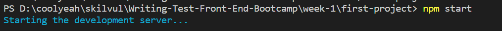
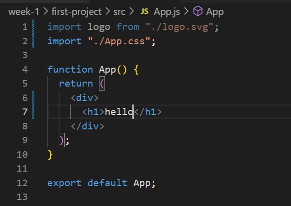
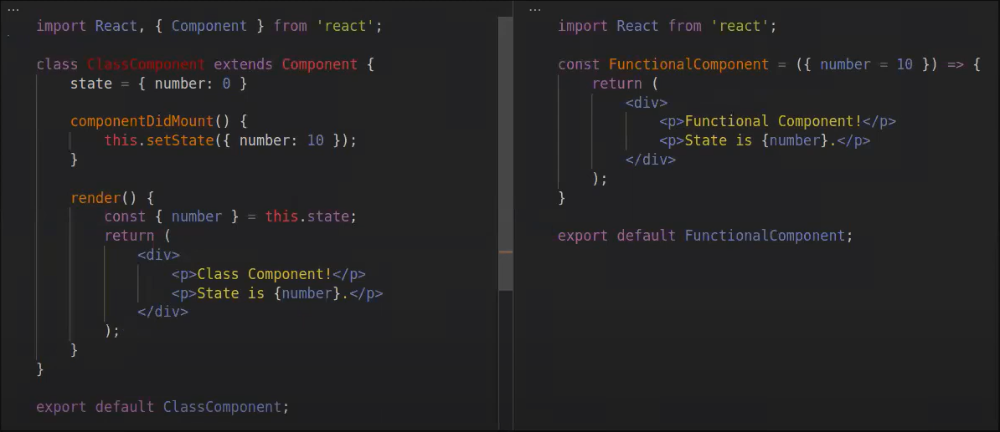

# Senin, 24 Oktober 2022

## **React JS**

React JS adalah library yang gunanya untuk membuat tampilan user interface website. React JS dapat mempermudah developer untuk memanipulasi tampilan, dan membuat event.

React JS membuat aplikasi front end jadi lebih cepat.

React JS bersifat:

- declarative
- component based
- learn once, write everywhere

Maksud dari Component-based adalah misalnya ketika kita membuat sebuah komponen navbar, maka kita hanya perlu membuat navbar sekali saja, kemudian ketika akan menggunakannya di banyak page, komponen navbar bisa dipanggil. Jadi ketika ada perubahan pada navbar, tidak perlu merubah semua navbar yang ada di setiap page (seperti pada JS vanilla).

### Single Page Application (SPA)

Sebelumnya pada Traditional Web Application, ketika kita ingin membuat beberapa halaman seperti _home, about, contact_, maka setiap halaman harus dibuat file htmlnya menjadi _home.html, about.html, contact.html_.

Namun ketika kita menggunakan teknologi SPA, maka kita hanya perlu satu file html saja, yaitu _index.html_. Dengan menggunakan react, maka javascript akan mengganti isi di dalamnya secara otomatis.

React menggunakan Virtual DOM utk berinteraksi dgn DOM.

Virtual DOM adalah duplikasi dari real DOM yang sebenarnya.

Beda Virtual DOM dan Real DOM.

- Pada Real DOM, ketika kita menambah elemen baru atau mengupdate suatu elemen, maka real DOM akan merender ulang semua elemen yang ada.

- Pada Virtual DOM, React JS hanya akan melakukan render ulang pada komponen yang diupdate. Jadi tidak semua komponen dirender ulang.

Hal itulah yang membuat React JS menjadi lebih cepat performancenya jika dibandingkan dengan Vanilla JS (JS biasa).

### Cara menggunakan React JS

1. Mendownload Node.js terlebih dahulu
2. Membuka cmd pada folder parent tempat di mana folder projek akan dibuat. contohnya di sini saya akan membuat sebuah projek baru pada folder week 1.

3. Menuliskan _npx create-react-app [nama folder]_

   ```
   npx create-react-app first-project
   ```

   <br>
   

   <br>

4. Projek selesai dibuat setelah cmd memberitahukan _Happy Hacking!_

   

   <br>

5. Isi dari folder react

   

    <br>

6. Cara menjalankan aplikasi react pada browser adalah dengan mengetikkan

   ```
   npm start
   ```

   contohnya pada projek react yang telah kita buat sebelumnya.

   

   Maka setelah menunggu beberapa saat, akan ada tab baru yang terbuka pada browser dan tampilan defaultnya akan terlihat seperti ini:

   

<br>

Dari gambar pada nomor 5 di atas, terdapat 3 folder di dalam folder projek react yang telah dibuat:

- **node_modules** -> berisi package-package yg digunakan dalam projek react
- **public** -> struktur utama web, memiliki _index.html_
- **src** -> isinya adalah file-file js dan css

Pada _index.html_ terdapat baris code

```html
<div id="root"></div>
```

elemen tersebut berada di dalam element <_body_>. Di dalam tag <_div id="root"></div_> tersebutlah nantinya akan disisipkan halaman-halaman lainnya seperti halaman about, contact, dll.

File _index.html_ ini akan secara otomatis memanggil file _index.js_ yang terdapat di dalam folder **src**.

Isi dari folder **src** :


<br>

cuplikan file **index.js**


Dapat dilihat bahwa pada _index.js_, virtual DOM dibuat dan virtual DOM mengambil element id 'root' dari file _index.html_.

Kemudian virtual DOM ini akan merender (menampilkan) **App**.

```html
<App />
```

Tapi dengan syarat, pada _index.js_ harusnya terlebih dahulu mengimport App.

```javascript
import App from "./App";
```

import diletakkan di bagian atas.

Berikut code lengkap dari _index.js_


App adalah sebuah **component** pada React. Setiap component akan berekstensi _.js_.

**src** > **App.js**



Pada _App.js_ akan mengexport _export default app_ agar App.js bisa diimport di _index.js_.
Selain itu, _function App_ memiliki nilai **return**. Return hanya dapat memiliki satu element parent. Pada contoh di atas, element parent dibungkus di dalam tag <_div_>.

contoh yang salah (**return** memiliki lebih dari satu element parent) :

```javascript
function App() {
    return (
        // elemen parent pertama
        <div>
            <h1>Judul</h1>
        </div>
        // elemen parent kedua
        <div>
            <p>Ini adalah isi paragraf</p>
        </div>
    )
}
```

Jika diperhatikan, App.js merupakan file javascript. Akan tetapi di dalamnya malah memuat penulisan html. Hal ini dikarenakan App sebenarnya adalah **jsx**, atau bisa dibilang **javascript xml**.

Jika ingin membuat component yang lain, maka hal yang perlu dilakukan adalah dengan membuat folder **components** di dalam folder **src**.


Di dalam folder **components** kita dapat membuat banyak component, misalnya kita akan membuat _Home.js_. Nantinya _Home_ dapat diexport ke _App.js_.

Penulisan nama function pada jsx adalah dengan diawali huruf kapital.

```javascript
function Home() {
  return;
  // tag kosong dapat digunakan sebagai parent element pada return untuk membungkus seluruh element-element lainnya di dalamnya.
  <></>;
}

//export Home agar bisa diimport ke App
export default Home;
```

Pada **App.jsx** import Home

```javascript
import Home from "./components/Home";
```

Contoh di atas adalah penulisan function yang benar.

### **Penulisan atribut 'class' pada JSX**

Pada HTML biasa, ketika kita hendak menambahkan sebuat atribut 'class' pada sebuah element, maka caranya adalah seperti ini :

```html
<div class="container"></div>
```

Sedangkan, pada JSX caranya agak sedikit berbeda. Perhatikan contoh di bawah.

```javascript
<div className="container"></div>
```

<br>

# Selasa, 25 Oktober 2022

## **Components**

Sekarang kita akan melihat contoh penggunaan component secara langsung. Kita akan membuat sebuah profile card seperti pada contoh gambar di bawah.


<br>
codenya adalah sebagai berikut :

```html
<div className="profile-container">
  
  <div className="profile-info">
    <h1>Farrah</h1>
    <h3>20 Tahun</h3>
  </div>
</div>
```

Ketika kita ingin membuat lebih dari satu _profile card_ seperti pada contoh, umumnya kita akan mengcopy code di atas beberapa kali. Namun dengan React kita tidak perlu melakukan hal tersebut. Kita akan menjadikan _profile card_ sebagai component.

Apa ciri suatu komponen dapat menjadi sebuah _component_ pada React?

```
Component dibuat jika component tersebut bersifat reusable code.
```

Pada kasus ini jika kita ingin membuat lebih dari satu _profile card_, maka dapat disimpulkan bahwa code _profile card_ akan menjadi reusable. Oleh karena itu, kita bisa menjadikan _profile card_ sebagai _component_ pada React. Component _profile card_ nantinya akan dipanggil pada **App.js** untuk ditampilkan ke tampilan web.

```javascript
import "./App.css";
import MemberInfo from "./components/MemberInfo";
import "./components/MemberInfo";

function App() {
  return (
    <>
      <MemberInfo />
      <MemberInfo />
      <MemberInfo />
    </>
  );
}

export default App;
```

Karena _MemberInfo_ dipanggil 3 kali pada **App.js**, maka ketika dijalankan pada browser, profile cardnya akan muncul sebanyak 3 kali juga.


Code pada **App.js** hanya berjumlah 3 baris. Beda halnya jika pada Vanilla JS, biasanya kita akan mengcopy code profile card sebanyak 3 kali. Hal ini menyebabkan code menjadi panjang.

Ketiga card di atas masih memiliki data yang sama. Untuk itu, sekarang akan dijelaskan bagaimana caranya agar setiap card di atas memiliki data yang berbeda dengan menggunakan **props** dan **state**.

### Props dan State

Props dan State adalah sebuah objek dalam Javascript yang digunakan untuk mengirim data.

State -> Data yang ada di dalam sebuah component.

_props_ digunakan sebagai parameter pada file component yang dituju.

Untuk lebih jelas perhatikan contoh di bawah.

**App.js**

```javascript
import "./App.css";
import MemberInfo from "./components/MemberInfo";
import "./components/MemberInfo";

function App() {
  return (
    <>
      <MemberInfo name={"Askia"} age={"20"} />
      <MemberInfo name={"Farrah"} age={"20"} />
      <MemberInfo name={"Garsia"} age={"20"} />
    </>
  );
}

export default App;
```

atribut name={"askia"} dan age={"20"} semuanya merupakan **state**.

State dari **App.js** akan dilemparkan menjadi **props** pada parameter **MemberInfo.jsx**

**MemberInfo.js** sebelum diberikan props.

```javascript
function MemberInfo(props) /*letakkan props pada parameter*/ {
  return (
    <div className="profile-container">
      
      <div className="profile-info">
        <h1>Farrah</h1>
        <h3>20 Tahun</h3>
      </div>
    </div>
  );
}
```

Kemudian berikan atribut pada baris code yang ingin ditampilkan.

<br>

**MemberInfo.jsx** sesudah diberikan props.

```javascript
function MemberInfo(props) /*letakkan props pada parameter*/ {
  return (
    <div className="profile-container">
      
      <div className="profile-info">
        <h1>{props.name}</h1>
        <h3>{props.age} Tahun</h3>
      </div>
    </div>
  );
}
```

```javascript
function MemberInfo({ name, age }) /*letakkan props pada parameter*/ {
  return (
    <div className="profile-container">
      
      <div className="profile-info">
        <h1>{name}</h1>
        <h3>{age} Tahun</h3>
      </div>
    </div>
  );
}
```

props juga dapat dituliskan langsung sesuai atributnya.

### useState

useState digunakan untuk menyimpan variabel yang sifat datanya berubah-ubah.

Sebelumny apabila ada variabel yang sudah didefinisikan nilainya, ketika ingin merubah nilainya maka kita hanya perlu menginisialisasikan nilainya ulang. Seperti contoh di bawah:

```javascript
let name = "Andi";
name = "Gayatri";
```

Sekarang akan diberikan contoh apabila menggunakan useState.

```javascript
let [name, setName] = useState("Andi");
setName("Gayatri");
```

Hal ini juga berlaku untuk **const**.

```javascript
const [name, setName] = useState("Andi");
setName("Gayatri");
```

Penggunaan useState ini biasanya akan memunculkan eror. Hal ini dikarenakan, tidak dideteksi adanya sesuatu yang memicu perubahan pada variabel tersebut. Untuk menyiasatinya, kita bisa tambahkan _button_ yang berfungsi sebagai jembatan untuk membuat nilai _name_ berubah.

```javascript
<button onClick={() => setName("Gayatri")}>change name</button>
```

## Stateful dan Stateless

Stateful -> Memiliki state dan bisa mengirim state tersebut ke component

Stateles -> Tidak memiliki state.

Pada contoh kasus project tadi, MemberInfo() adalah **stateless** karena hanya memiliki props.
Sedangkan App() adalah **stateful** karena memiliki props dan state.

### Menggunakan Bootstrap pada React

- Menggunakan React Bootstrap
- Menggunakan React Biasa

Yang akan dibahas sekarang adalah menggunakan react biasa. Caranya ada 2:

1. Menggunakan versi CDN -> memasang script JS dan stylesheet CSSnya pada _index.html_
2. Install bootstrap melalui npm

Bootstrap tersebut diinstall di dalam direktori projek react yang dituju.

```
npm install bootstrap
```

Berikutnya pada **index.js** import Bootstrap CSS dan Bootstrap Bundle JSnya.

```
import "bootstrap/dist/css/bootstrap.min.css";

import "bootstrap/dist/js/bootstrap.bundle.min";
```

note: cara untuk menggunakan react biasa ini hanya bisa dipilih salah satu, tidak bisa keduanya.

note: Apabila memilih untuk menggunakan Bootstrap biasa pada React, maka harus selalu ingat untuk mengganti nama atribut. Seperti atribut **class** harus ditulis menjadi **className**, dan lain-lain.

# Rabu, 26 Oktober 2022

### React Event

**Counter.jsx** akan menjadi component sebuah tombol untuk menambah dan mengurangi suatu number.

```javascript
function Counter() {
  let count = 0;

  return (
    <>
      <button>-</button>
      <span>{count}</span>
      <button>+</button>
    </>
  );
}

export default Counter;
```


Kemudian **Counter.jsx** akan diimport ke **App.jsx** dan dipanggil functionnya di dalam return.

**App.jsx**

```javascript
import Counter from "./Counter.jsx";

function App() {
  return (
    <div>
      <Counter />
    </div>
  );
}

export default App;
```

Kita ingin agar ketika diklik tombol + maka angka 0 akan bertambah sebanyak +1 dan berubah nilainya menjadi 1. Apabila diklik lagi maka akan +1 lagi menjadi 2, dan seterusnya. Begitu juga hal yang sama apabila diklik tombol -

Untuk itu, kita perlu menambahkan event onClick pada _button_ kemudian membuat sebuah function pada event onClick.

Akan tetapi, variable pada JS bersifat _immutable_. Maka dari itu, hal ini bisa diakali dengan menggunakan **useState**.

```javascript
function Counter() {
  // let count = 0;

  const [count, setCount] = useState(0); //nilai awal count adalah 0, dan apabila ingin diganti nilai variable count haruslah dengan menggunakan method setCount

  //function increment untuk menambah nilai count menjadi +1
  const increment = () => {
    setCount(count + 1);
  };

  //tambahkan event onClick = {increment} pada button +
  return (
    <>
      <button>-</button>
      <span>{count}</span>
      <button onClick={increment}>+</button>
    </>
  );
}

export default Counter;
```

Kemudian untuk fungsi membuat nilai _count_ menjadi -1, kita dapat menambahkan event onClick juga pada button -

Namun di sini kita tidak perlu membuat function baru (namun jika ingin tidak masalah juga). Kita ha

```javascript
function Counter() {
  // let count = 0;

  const [count, setCount] = useState(0); //nilai awal count adalah 0, dan apabila ingin diganti nilai variable count haruslah dengan menggunakan method setCount

  //function increment untuk menambah nilai count menjadi +1
  const increment = () => {
    setCount(count + 1);
  };

  //tambahkan event onClick pada button minus, dan callback akan menjalankan function.
  return (
    <>
      <button onClick={() => setCount(count - 1)}>-</button>
      <span>{count}</span>
      <button onClick={increment}>+</button>
    </>
  );
}

export default Counter;
```

### Menggunakan method array _.map_

Jika ada sebuah component **ListUser.jsx**, di mana di dalamnya akan memanggil component lain, yaitu **Card.jsx**. Pada **ListUser.jsx**, kita ingin menampilkan banyak card dengan setiap card memiliki state (data) yang berbeda-beda. Dengan cara biasa, kita akan mengcopas pemanggilan component _Card_ sebanyak yang diinginkan kemudian mengganti nilai statenya.


Kita dapat menggunakan cara lain, yaitu dengan menggunakan useState untuk membuat sebuah variabel berbentuk array.


Setelah memiliki array, sekarang kita akan tampilkan data array tersebut menggunakan method _.map_.


### Penggunaan event onClick untuk men*hide* dan men-_show_ sebuah elemen (Conditional Rendering)


# Kamis, 27 Oktober 2022

## Life Cycle

Life cycle adalah siklus component.

- mount -> ketika component muncul
- update
- unmount -> component hilang

contoh:

- mount -> mengklik tombol login, maka component page untuk login akan muncul
- update -> ketika menginput password dan email pada form login
- unmount -> mengklik menu lain pada navbar (misalnya menu about) sehingga component page login akan hilang (sebenarnya tidak literal hilang, namun akan berganti ke page about)


## Function Component vs Class Component

Class component digunakan pada versi React JS yang terdahulu.



### Life cycle pada class component.


Hooks

1. useState
2. useEffect

### Side Effect pada Life Cycle menggunakan useEffect()

useEffect() berguna untuk memberikan efek samping pada proses Life Cycle. Contohnya pada saat mounting (component muncul di layar) maka kita dapat menambahkan sebuah efek samping. Atau pada saat update, efek samping tersebut juga akan muncul.

- import useEffect terlebih dahulu pada file jsx yang akan menggunakan useEffect

  ```javascript
  import { useEffect } from "react";
  ```

- menambahkan function useEffect() pada component yang diinginkan

function useEffect diletakkan sebelum return.

- menerapkan function useEffect() hanya sekali saja (yaitu pada saat mounting)

```javascript
useEffect(() => {
  //code
}, []); // menambahkan []
```

<br>

# Jumat, 28 Oktober 2022

Hari ini saya mengikuti Live Class seperti biasa di jam 7-9.30 pagi. Materi kali ini dipandu oleh Kak Dilla. Saya belajar cara membuat FORM menggunakan React JS.

## Menginput data melalui FORM pada React JS

- membuat component Form

  

- membuat tag form di dalam return

  

- atribut htmlFor

  Pada HTML, saat membuat atribut **for** pada tag <_label_> di React ada sedikit perbedaan dalam penulisannya.

  

- menampung data menggunakan state

  Kita akan menampung inputan _name_ user pada state

  - import useState
  - buat state untuk name dan address
    
  - menangkap inputan user menggunakan **value** dan **onChange**
    

- mengirim data setelah button submit ditekan

  Pada React, mengirim data menggunakan function onSubmit. onSubmit diletakkan di dalam opening tag form. Syaratnya adalah memasukkan type='submit' pada button.

  

- membuat function handleSubmit
  
