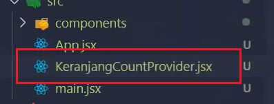
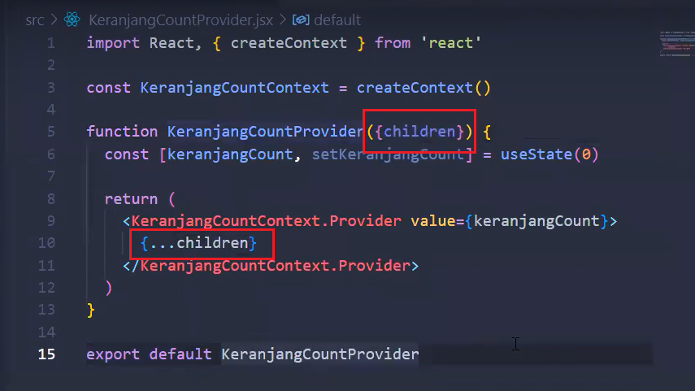

# Senin, 07 November 2022

## Context : an alternative to passing props

Context membuat parent component dapat membagikan data di dalamnya kepada seluruh children component di bawahnya.

Penggunaan context dapat menghindari **props drilling** karena **context menyediakan cara untuk mengoper data ke seluruh tree component tanpa harus mengoper props ke bawah satu persatu secara manual**.

ide sederhana dari context:
kita akan membuat sebuah **component context** (file component yang berisi context), kemudian component context tersebut akan memprovide props utk seluruh components lainnya.


Untuk contohnya, perhatikan gambar di bawah.


Maka dari itu, akan dibuat sebuah component context bernama **KeranjangCountProvider.jsx**.

### **proses membuat context**

1. Membuat file context
   

2. Mengimport createContext

   ```javascript
   import { createContext } from "react";
   ```

3. Membuat context dengan createContext()
   

4. Membuat provider
   Membuat provider dengan memanggil nama context dan menambahkan .Provider pada returnnya.

    

5. Membuat state utk angka 0 pada keranjang
   

6. Memberikan value ke dalam tag Provider agar seluruh component yang dibungkus di dalam tag Provider dapat menggunakan state
   

7. Memberikan {children} sebagai parameter dari function

   Karena kita mau stater **keranjangCount** diberikan pada seluruh component, maka kita dapat memberikan parameter pada function KeranjangCountProvider dan memberikan {...children} di dalam bungkusan tag <KeranjangCountContext.Provider>

   

   <br>

   {...children} akan berisi App, di mana App akan berisi seluruh component yang ada.

   

8. Panggil component context di dalam main.jsx / index.js
   

---

### Menggunakan props yang sudah disediakan pada component context menggunakan useContext


# Selasa, 08 November 2022

## Menggunakan useReducer

- Permasalahan<br>
   jika nanti mempunyai aplikasi yang sudah besar dan masih memparsing data menggunakan props, akan kecapean kedepannya ketika sudah mempuyai banyak data dan komponen.

- Langkah-langkah<br>
   + Install react<br>
      Cukup membuka terminal / CMD dan jalankan perintah berikut:
      ```js
      npm i -g create-react-app
      ```
   + Membuat react project<br>
      ```js
      npx create-react-app nama-project
      ```
      Lalu open text editor.
   + Membuat context<br>
      ```js
      import { createContext } from "react"

      export default createContext()
      ```
   + Membuat types<br>
      Types ini berfungsi untuk mendefinisikan apa saja yang akan dilakukan oleh aplikasi.
   + Membuat reducer<br>
      Reducer di ReactJS berfungsi untuk menentukan state-state yang akan berubah di dalam aplikasi kita. Untuk kasus ini, jika kamu ingin mengubah state-state, maka kamu harus mengkontrol semuanya di sini.
   + Membuat state<br>
      Di langkah ini, ini adalah akar dari si Context ini. Di dalam file ini akan berisikan state-state, fungsi-fungsi, dan beberapa nilai yang akan digunakan oleh si komponen nantinya. Di sinilah kita membuat macam halnya seperti variable global dengan context, berikut kodenya. State ini digunakan untuk mendeklarasikan state-state yang akan kita gunakan, fungsi-fungsi yang beritenraksi dengan server, dan beberapa logic untuk aplikasi ini. Jika ingin menambahkan fungsi maka dapat ditambahkan di sini dan jangan membuat fungsi yang berinteraksi dengan server di komponen.

# Rabu, 09 November 2022

## React Testing

Testing bisa dilakukan secara manual (manual testing) dan secara otomatis (automated testing).

Automated testing terbagi 3:

- unit test -> test unit paling kecil, misalnya function.
- integration test -> testing apakah aplikasi sudah terhubung dengan sistem yang lain (cth: database)
- end-to-end test -> testing dari sudut pandang user


Cara menulis testing ada 2:

- membuat fitur terlebih dahulu, baru menulis code testing
- membuat code testing, baru membuat fitur (TDD)

### TDD circle


## Unit Testing


### React Testing Library (RTL)

RTL menggunakan depedencies @testing-library yang sudah terinstall ketika membuat react app.


